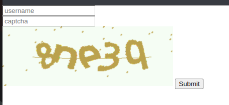
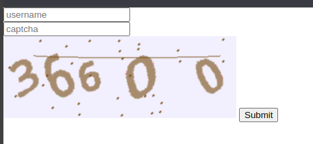
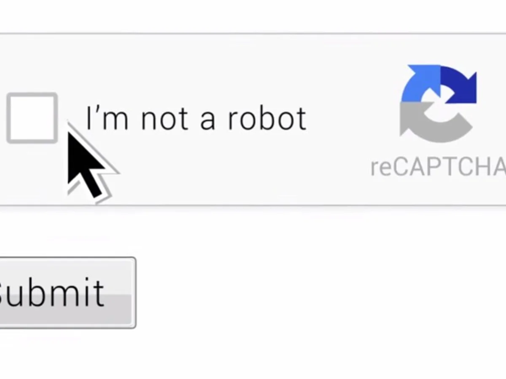

flask captcha2
===============


Flask plugin to integrate Google-captcha (version 2, 3) and local
captcha (image, voice) with Flask applications

<a href="https://www.coffeete.ir/alisharify7">Donate/Support [Optional]</a>

  

[](https://pypi.python.org/pypi/Flask-captcha2)[](https://pypi.python.org/pypi/flask_captcha2) [](https://pepy.tech/project/flask-captcha2) [](https://pepy.tech/project/flask-captcha2)
  


🚀 demo 
------------------





🔨 0.0 how to install:
-------------------

``` {.}
pip install -U flask_captcha2 
```

🔧 0.1 how to use:
---------------

```python
from flask import Flask
from flask_captcha2 import FlaskCaptcha

app = Flask(__name__)


 google_captcha2_config_list = {
     "CAPTCHA_PRIVATE_KEY": "hish !",
     "CAPTCHA_PUBLIC_KEY": "hish !",
     'CAPTCHA_ENABLED': True,  # captcha status <True, False> 
     "CAPTCHA_LOG": True, # show captcha logs in console
     "CAPTCHA_LANGUAGE": "en" # captcha language
 }

 google_captcha3_config_list = {
     "CAPTCHA_PRIVATE_KEY": "hish !",
     "CAPTCHA_PUBLIC_KEY": "hish !",
     'CAPTCHA_ENABLED': True,  # captcha status <True, False> 
     "CAPTCHA_SCORE": 0.5,  #google captcha version3 works with scores
     "CAPTCHA_LOG": True  # show captcha requests and logs in terminal > stdout
 }

 MainCaptcha = FlaskCaptcha(app=app)  # app is required
 # passing config list directly
 google_captcha2 = MainCaptcha.get_google_captcha_v2(name='g-captcha2', conf=google_captcha2_config_list)
 google_captcha3 = MainCaptcha.get_google_captcha_v3(name='g-captcha3', conf=google_captcha3_config_list)
 # Namespaces are important. Do not use repeated names and choose names with meaning.
```

google captcha docs
https://developers.google.com/recaptcha/docs/v3
## example:

```python
# you can also pass nothing and it will be uses app.config for filling configs
 app.config.update(google_captcha3_config_list) # set configs in app.config
 MainCaptcha = FlaskCaptcha(app=app)
 # No need to send conf_list, it will be set automatically from app.config
 google_captcha2 = MainCaptcha.get_google_captcha_v2(name='g-captcha2')
```

0.2 how use in templates for rendering Captcha Widget:
------------------------------------------------------

#### Use < captcha.render_captcha > Filter to render a captcha in html

##### -> Remember namespaces argument in crating a captcha object

```python
google_captcha2 = MainCaptcha.get_google_captcha_v2(name='g-captcha2') # name
google_captcha3 = MainCaptcha.get_google_captcha_v3(name='g-captcha3') # name
```

for rendering a captcha width you should pass name to < model_name > in < captcha.render_captcha >

## rendering Google Version 2 Captcha:

```html
<!DOCTYPE html>
<html lang="en">
<head>
    <meta charset="UTF-8">
    <meta http-equiv="X-UA-Compatible" content="IE=edge">
    <meta name="viewport" content="width=device-width, initial-scale=1.0">
    <title>Captcha version 2</title>
</head>
<body>

 <form method="POST" action="some-url">
     <input placeholder="username" type="text" name="username" id="">
     <br>
     <input placeholder="password" type="password" name="password" id="">
     <br>
     <input value="submit" type="submit">

     {# 
        all available parameter for google captcha version 2:
            model_name: required,
            id: optional,
            css_class: optional,
            inline_css: optional,
            js_event: optional,
            dataset: optional,
     #}
    
     
     {{
     captcha.render_captcha (
            # [Required] namespace
             model_name='g-captcha2', 
                
            # [Optional] add id to captcha widget
             id='g-captcha-v2',
                 
            # [Optional] add css class to captcha widget
            css_class='p-2 btn btn-primary',
            
            # [Optional] add inline css to captcha widget
            inline_css='font-size:10px;', 
            
            # [Optional] add dataset to captcha widget
            dataset="data-checked='true';"
            
            # [Optional] add js event to captcha widget
            js_event="onclick(alert('clicked!'))", 
        )
     }}

 </form>
</body>
</html>
```

## Google captcha version 2 `render` parameters

| parameter  | description                      | type | status     | 
|------------|----------------------------------|------|------------|
| model_name | namespace                        | str  | `Required` |
| id         | id of captcha widget in html     | str  | `Optional` |
| css_class  | add css class to captcha widget  | str  | `Optional` |
| inline_css | add inline css to captcha widget | str  | `Optional` |
| dataset    | add dataset to captcha widget    | str  | `Optional` |
| js_event   | add js event to captcha widget   | str  | `Optional` |

## rendering Google Version 3 Captcha :

```html
<!DOCTYPE html>
<html lang="en">
<head>
    <meta charset="UTF-8">
    <meta http-equiv="X-UA-Compatible" content="IE=edge">
    <meta name="viewport" content="width=device-width, initial-scale=1.0">
    <title>Captcha version 3</title>
</head>
<body>

 <form method="POST" action="/v3" id="ParentForm"> # <---- parent_form_id 

{# you can also use Flask-wtf forms #}
 <input placeholder="username" type="text" name="username" id="">
 <br>
 <input placeholder="password" type="password" name="password" id="">
 <br>
 {{
     captcha.render_captcha (
     # [Required] Namespace
     model_name='g-captcha3'

     # [Optional] add id to captcha widget
     id="SubmitBtnForm"

     # [Optional] add custom css class to captcha widget
     css_class='custom-class-name'

     # [Optional] inline css of captcha widget
     inline_css="background-color:blue; color:white; font-size:2rem;"

     # [Optional] add dataset to captcha widget
     dataset="data-ok='true' data-test='test data set check' "

     # [Required] if of parent form
     parent_form_id="ParentForm"

     # [Required] text content of the submit button
     button_text="submit This Form"

     # [Optional] javascript event of captcha widget
     js_event="onclick='alert('this is inline event');' "

     # [Optional] set visibility of captcha widget in bottom right corner,
     # this parameter doesn't disable captcha, its only hidden the captcha in
     # the page, but captcha still works
     hide_badge=True
     )
 }}
 </form>
</body>
</html>
```

## Google captcha version 3 `render` parameters

| parameter      | description                                                                                                                                                       | type | status     | 
|----------------|-------------------------------------------------------------------------------------------------------------------------------------------------------------------|------|------------|
| model_name     | namespace                                                                                                                                                         | str  | `Required` |
| id             | id of captcha widget in html                                                                                                                                      | str  | `Optional` |
| css_class      | add css class to captcha widget                                                                                                                                   | str  | `Optional` |
| inline_css     | add inline css to captcha widget                                                                                                                                  | str  | `Optional` |
| dataset        | add dataset to captcha widget                                                                                                                                     | str  | `Optional` |
| js_event       | add js event to captcha widget                                                                                                                                    | str  | `Optional` |
| parent_form_id | id of parent form element                                                                                                                                         | str  | `Required` |
| hide_badge     | set visibility of captcha widget in bottom right corner, this parameter doesn't disable captcha, its only hidden the captcha in the page, but captcha still works | str  | `Optional` |
| button_text    | text context of the captcha button                                                                                                                                | str  | `Required` |

0.3 How to verify Captcha:
-----------------------

Use the is_verify method on captcha objects for validating a request that
contains a captcha 

```python
@app.route("/g-v2-verify/", methods=["POST"])
def index():
    # with is_verify method verify the captcha 
    if google_captcha2.is_verify():
        return "Captcha is ok."
    else:
        return "Try again!"

@app.route("/g-v3-verify/", methods=["POST"])
def index():
    # with the is_verify method verify the captcha
    if google_captcha3.is_verify():
        return "Captcha is ok."
    else:
        return "Try again!"
```

### Version History:

-   version 2.0.0 Released: May 18, 2023

-   Changes: - None

-   version 2.0.1 Released: June 9, 2023

-   Changes:

    > -   Change FlaskCaptcha Class to FlaskCaptcha2
    > -   Fix bug in rendering captcha widget when captcha-enable was False

-   version 3.0.0 Released: September 9, 2023

-   Changes:

    > -   Change package structure
    > -   Add Captcha version 3 and fix some bugs in Captcha version 2

-   version 3.0.4 Released: October 27, 2023
-   Changes:

    > -   reformat/Refactor project structure
    > -   adding FlaskCaptcha Master class
    > -   adding getFlaskCaptcha3 method for getting google-captcha
    >     version 3
    > -   adding getFlaskCaptcha2 method for getting google-captcha version 2
    > -   adding namespacing for each captcha
    > -   adding the ability to create multiple captchas with different versions
    > -   adding pytest base test

  
- version 3.0.5 Released: July 21, 2024
-   Changes:

    > -   reformat/Refactor code
    > -   rename render_captcha parameters
  
- version 3.1.0 Released: September 28, 2024
-   Changes:

    > -   reformat/Refactor code
    > -   Refactoring all method and function signatures to adhere to PEP8 input parameter naming conventions.
    > -   minor changes.

